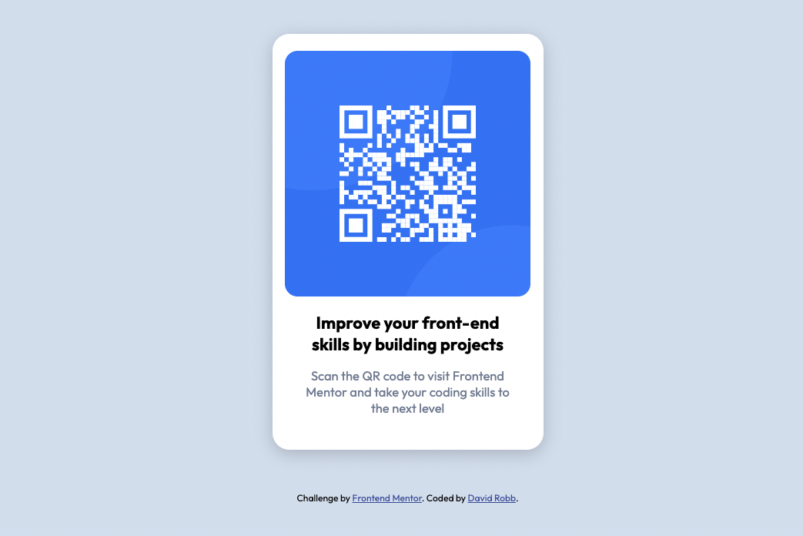

# Frontend Mentor - QR code component solution

This is a solution to the [QR code component challenge on Frontend Mentor](https://www.frontendmentor.io/challenges/qr-code-component-iux_sIO_H). Frontend Mentor challenges help you improve your coding skills by building realistic projects.

## Table of contents

- [Frontend Mentor - QR code component solution](#frontend-mentor---qr-code-component-solution)
  - [Table of contents](#table-of-contents)
  - [Overview](#overview)
    - [Screenshot](#screenshot)
    - [Links](#links)
  - [My process](#my-process)
    - [Built with](#built-with)
    - [What I learned](#what-i-learned)
    - [Continued development](#continued-development)
  - [Author](#author)
  - [Acknowledgments](#acknowledgments)

**Note: Delete this note and update the table of contents based on what sections you keep.**

## Overview

### Screenshot

### Links

- Solution URL: [Github](https://github.com/drobb2020/qr-code-component)
- Live Site URL: [Netlify](https://comforting-cat-e32074.netlify.app/)

## My process

### Built with

- Semantic HTML5 markup
- CSS custom properties
- Flexbox

### What I learned

I learned that I actually have the skills to complete one of these challenges on my own.

### Continued development

Take on more Frontend Mentor challenges.

## Author

- Website - [David Robb](https://davidrobb2021.tech)
- Frontend Mentor - [@drobb2020](https://www.frontendmentor.io/profile/drobb2020)
- Twitter - [@DavidRobb2](https://www.twitter.com/DavidRobb2)

## Acknowledgments

I want to thank all the mentors I have followed on YouTube that got me to this point where I can complete a challenge on my own.
